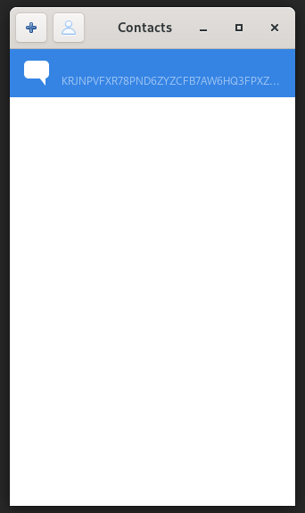

# cadet-gtk

A GTK based GUI for the CADET subsystem of GNUnet.

This application requires [libhandy](https://gitlab.gnome.org/GNOME/libhandy/)
0.0.12 or later, as it uses it in order to make it work as a mobile application
too.

It runs the actual handling of CADET as second process and communicates to the main process with the GUI
via unix specific pipes.

## Installation

### Arch

You can install directly from the source via the package [cadet-gtk-git](https://aur.archlinux.org/packages/cadet-gtk-git/) in the AUR.

### Other

You will need to clone the [repository](https://gitlab.com/TheJackiMonster/cadet-gtk.git) and compile it from source with cmake.
You should notice that you will need a quite current release of GNUnet installed so maybe you will need to compile
this from [source](https://git.gnunet.org/gnunet.git) too.

## Progress

If you want to take a look at all the releases and its changes: [Release Notes](CHANGES.md)

You can see all other features and bigger changes which are planned right here:

 * [ ] Allow creating a normal chat with JSON.
 * [ ] Allow viewing all members in a groupchat more conveniently.
 * [ ] Allow changing your nickname via GUI.
 * [ ] Use pEp for authentification and encryption (maybe with a gtk-adapter?).
>  More information here: https://pep.software/about/
 * [ ] Use pEp-sync to use the application on multiple peers concurrently.
 * [ ] Allow sharing files privately through GNUnet and encryption.
>  More information how to share files via CLI: https://gnunet.org/en/use.html#filesharing
 * [ ] Implementing audio-calls with the conversation of GNUnet.

## Docs I use

 - GTK3: https://developer.gnome.org/gtk3/stable/
 - libhandy: https://developer.puri.sm/projects/libhandy/unstable/
 - GNUnet: https://docs.gnunet.org/doxygen/modules.html
 - Jansson: https://jansson.readthedocs.io/en/2.8/apiref.html
 - pipe: https://linux.die.net/man/2/pipe

## Who is contributing

 - Tobias Frisch ( thejackimonster@gmail.com )
