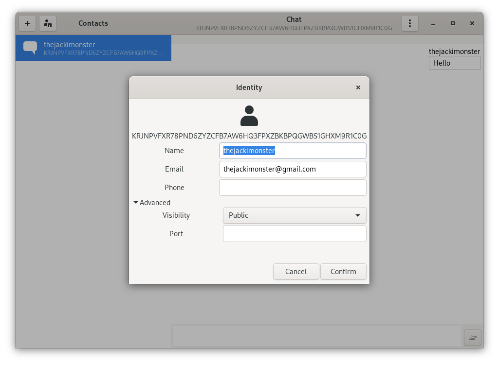
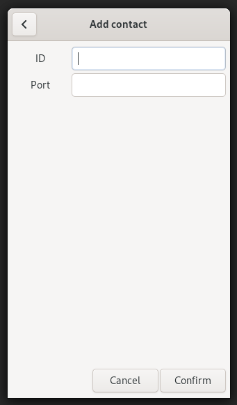
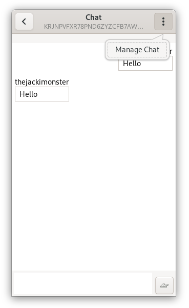

# cadet-gtk

A GTK based GUI for the CADET subsystem of GNUnet.





This application requires [libhandy](https://gitlab.gnome.org/GNOME/libhandy/)
1.0.0 or later, as it uses it in order to make it work as a mobile application
too.

It also depends on [libnotify](https://developer.gnome.org/libnotify/).

It runs the actual handling of CADET as second process and communicates to the main process with the GUI
via unix specific pipes.

## Installation

### Arch

You can install directly from the source via the package [cadet-gtk-git](https://aur.archlinux.org/packages/cadet-gtk-git/) in the AUR.

### Ubuntu

You can find a script to install this project from source in the `setup` directory for following versions:

- [Ubuntu 20.10](setup/ubuntu_20.10.sh)

### Other

You will need to clone the [repository](https://gitlab.com/TheJackiMonster/cadet-gtk.git) and compile it from source with the provided build script.
```
./build.sh 'release'
./install.sh '/usr'
```
You should notice that you will need a quite current release of GNUnet installed so maybe you will need to compile this from [source](https://git.gnunet.org/gnunet.git) too.

## Progress

If you want to take a look at all the releases and its changes: [Release Notes](CHANGES.md)

You can see all other features and bigger changes which are planned right here:

 * [ ] Show names of members of a group (connected to the names used in one-to-one chats).
 * [ ] Providing more consistency between multiple channels to the same destination.
 * [ ] Allow setting up a profile picture.
 * [ ] Adding a history of contacts, messages, files and keys between sessions.
 * [ ] Upgrading the security inside of groupchats.
 * [ ] Making groupchats more decentralized rather than hosted by one node.
 * [ ] Adding support for GNUpG as authentification and encryption method for file transfer.
>  More information about GpG: https://gnupg.org/
 * [ ] Using EGO for establishing an identity between devices and using GNS
>  (useful for reclaim attributes and tickers which could add new privacy features)
 * [ ] Use pEp for authentification and encryption (maybe with a gtk-adapter?).
>  More information here: https://pep.software/about/
 * [ ] Use pEp-sync to use the application on multiple peers concurrently.
 * [ ] Implementing audio-calls with the conversation of GNUnet.

## Docs I use

 - GTK3: https://developer.gnome.org/gtk3/stable/
 - libhandy: https://developer.puri.sm/projects/libhandy/unstable/
 - GNUnet: https://docs.gnunet.org/doxygen/modules.html
 - Jansson: https://jansson.readthedocs.io/en/2.8/apiref.html
 - pipe: https://linux.die.net/man/2/pipe
 - GpGMe: https://www.gnupg.org/documentation/manuals/gpgme/

## Who is contributing

 - Tobias Frisch ( thejackimonster@gmail.com )
 - Marcos Marado ( mindboosternoori@gmail.com )
