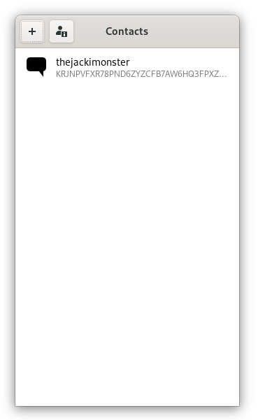
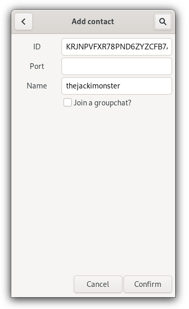

# cadet-gtk

A GTK based GUI for the CADET subsystem of GNUnet.

This application uses early and unstable additions to [GTK](https://www.gtk.org/) 
from [libhandy](https://source.puri.sm/Librem5/libhandy) to make it work as mobile application too.

It runs the actual handling of CADET as second process and communicates to the main process with the GUI
via unix specific pipes.

* [x] The first target of this application is being able to communicate with the basic 
cli for CADET.
> source is here: https://git.gnunet.org/gnunet.git/tree/src/cadet/gnunet-cadet.c
* [x] The second target is creating a channel towards another peer.
* [x] An advanced target is to handle multiple channels at once.
* [x] Choosing a specific port instead of a default ('test') one.
* [x] Ports make channels and chats completely independent of each other.
* [ ] Integrating a layer with JSON or similar to allow metadata in messages.
* [ ] Integrating the current state of functionality of the groupchat-application.
> source is here: https://git.gnunet.org/groupchat.git/tree/

## Docs I use

 - GTK3: https://developer.gnome.org/gtk3/stable/
 - libhandy: https://developer.puri.sm/projects/libhandy/unstable/
 - GNUnet: https://docs.gnunet.org/doxygen/modules.html
 - pipe: https://linux.die.net/man/2/pipe

## Who is contributing

 - Tobias Frisch ( thejackimonster@gmail.com )
